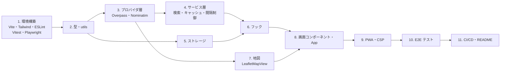

# 設計：初回実装

本書は `requirements.md` の内容を実装するための具体的な方針を定義する。
全体の設計は `docs/` に従う。ここでは、`docs/` で決めていない実装上の判断を中心に記載する。

## 1. 実装アプローチ

### 1.1 実装の順序

依存される側（下位のレイヤー）から順に作り、各段階でテストを書いてから次に進む。



- 地図（7）は画面の見た目の確認に必要なため、プロバイダ層の直後に着手してよい
- 画面は「一覧表示まで」→「詳細・ナビ」→「地名検索」→「お気に入り・メモ」の順に、動く状態を保ちながら機能を足していく

### 1.2 主要ライブラリ

| パッケージ | 用途 | 備考 |
|---|---|---|
| `react`、`react-dom` | UI | |
| `leaflet`、`react-leaflet` | 地図 | |
| `tailwindcss`、`@tailwindcss/vite` | スタイリング | Vite プラグイン方式で導入する |
| `vite-plugin-pwa` | PWA | |
| `vitest`、`@testing-library/react`、`@testing-library/user-event`、`jsdom` | 単体テスト | |
| `msw` | API モック（単体テスト） | |
| `@playwright/test` | E2E テスト | |
| `eslint`、`typescript-eslint`、`eslint-plugin-react-hooks` | リント | |
| `prettier`、`prettier-plugin-tailwindcss` | 整形 | |
| `@vite-pwa/assets-generator` | PWA アイコンの生成 | SVG の元画像から PNG を生成し、生成物をコミットする |

- ボトムシートやアイコンのライブラリは導入しない（バンドルサイズの目標を守るため）。アイコンは SVG を直接書く

## 2. 設定値（環境変数）

`src/config.ts` で読み込み、型を付けて各所に渡す。値が不正なときは既定値を使う。

| 環境変数 | 既定値 | 用途 |
|---|---|---|
| `VITE_PROVIDER` | `osm` | 提供元の選択 |
| `VITE_OVERPASS_URL` | `https://overpass-api.de/api/interpreter` | Overpass のエンドポイント |
| `VITE_NOMINATIM_URL` | `https://nominatim.openstreetmap.org` | Nominatim のエンドポイント |
| `VITE_DEFAULT_CENTER` | `34.393885,131.401059`（山口県萩市・萩駅） | 初回起動時の地図の中心（緯度,経度） |
| `VITE_DEFAULT_ZOOM` | `15` | 初回起動時のズーム |
| `VITE_BASE_PATH` | `/` | 公開 URL のパス。GitHub Pages では `/{リポジトリ名}/` を指定する |

- `.env.example` にすべての変数を記載する
- `VITE_DEFAULT_CENTER` の既定値は、生活圏の中心として萩駅（OSM の萩駅の駅舎の座標）とする。変更したい場合は、ローカルの `.env` と GitHub Actions の設定で上書きする

## 3. レイヤーごとの実装方針

### 3.1 プロバイダ層（`providers/`）

**ファクトリ（`providers/index.ts`）**

```ts
export function createParkingProvider(config: AppConfig): ParkingProvider;
export function createGeocodingProvider(config: AppConfig): GeocodingProvider;
/** 提供元の地図コンポーネントを遅延読み込みする */
export const MapView: React.LazyExoticComponent<React.ComponentType<MapViewProps>>;
```

- `MapView` は `React.lazy` と動的 import で読み込み、`App` 側は `Suspense` で囲む。これにより、選ばれなかった提供元の地図ライブラリをバンドルに含めない

**OverpassParkingProvider**

- `docs/functional-design.md` 4.1 節のクエリを、`application/x-www-form-urlencoded` の `data` パラメータとして POST する
- 座標と半径はクエリに埋め込む前に数値として検証し、半径は整数に丸める
- HTTP ステータスと `ProviderError` の対応

| 応答 | kind |
|---|---|
| 429、504 | `rate-limit` |
| その他の 4xx・5xx | `network` |
| `fetch` 自体の失敗 | `network` |
| JSON でない、`elements` が配列でない | `invalid-response` |
| `AbortError` | `aborted`（タイムアウトによる中断は `timeout`） |

- タイムアウトは、呼び出し元の `signal` とタイムアウト用の `signal` を `AbortSignal.any()` で合成して実現する
- 個々の要素（element）の形式が不正な場合は、その要素だけを捨てる。全体をエラーにはしない

**overpassMapper**

- `docs/functional-design.md` 3.2 節の変換表どおりに実装する
- way・relation は `center` の座標を使う。`center` が無い要素は捨てる

**NominatimGeocodingProvider**

- `GET {VITE_NOMINATIM_URL}/search?format=jsonv2&q={入力}&countrycodes=jp&accept-language=ja&limit=5`
- 入力値は `URLSearchParams` でエンコードする
- `display_name` を `label` に、`lat`・`lon`（文字列）を数値に変換して `location` にする

**LeafletMapView**

- 駐車場マーカーには `CircleMarker` を使う。画像ファイルが不要で、バンドラーでの Leaflet 標準アイコンのパス問題も避けられる。100 件程度なら描画も軽い
- 選択中のマーカーは、半径を大きくして `primary` の色にする
- 中心マーカーは `divIcon` に SVG を入れて表示する。検索範囲は `Circle` で表示する
- ポップアップは使わない。マーカーをタップしたら `onMarkerClick` を呼び、詳細はボトムシートに表示する
- 地図のタップは `useMapEvents` の `click` で受け取る。ドラッグ直後に誤って検索しないよう、Leaflet 標準の判定に任せる
- `center` の props が変わったら `flyTo` で移動する。利用者が地図を動かした結果の変更（`onViewChange` で通知したもの）では移動処理を行わない

### 3.2 サービス層（`services/`）

**ParkingSearchService**

テストしやすいよう、依存するものをコンストラクタで受け取る。

```ts
class ParkingSearchService {
  constructor(deps: {
    provider: ParkingProvider;
    cache: SearchCache;
    throttle: RequestThrottle;
  });
  search(center: LatLng, radiusM: number, signal?: AbortSignal): Promise<ParkingSearchResult[]>;
}
```

- 処理の順序：キャッシュ確認 → 間隔制御の待機 → プロバイダ呼び出し → キャッシュ保存 → 利用制限でのフィルタ → 距離計算 → 距離順に並べ替え
- キャッシュには、フィルタと並べ替えを行う前のプロバイダの結果を保存する

**SearchCache**

- `Map` に「キー → 保存時刻と結果」を保持する。有効期間は 10 分
- 現在時刻の取得処理を差し替えられるようにし、テストで有効期限の切れを再現できるようにする
- 保存件数の上限は 50 件とし、超えたら最も古いものから削除する

**RequestThrottle**

- 直前の呼び出しから `minIntervalMs`（1,000ms）経っていなければ、残り時間だけ待ってから実行する
- 待機中に `signal` が中断されたら、待機をやめて `aborted` の `ProviderError` を投げる
- Overpass 用と Nominatim 用で別々のインスタンスを使う

### 3.3 ストレージ（`storage/`）

- `storage.ts` に、次の共通関数を用意する
  - `readJson<T>(key, guard, fallback)`：読み込みと JSON の解析を行い、型ガードで検証する。失敗したら `fallback` を返す
  - `writeJson(key, value)`：JSON に変換して保存する。容量超過などで失敗しても、例外を外に出さず `false` を返す
- `favoritesStorage.ts`・`settingsStorage.ts` は、この共通関数と型ガードを使って実装する

### 3.4 フック（`hooks/`）

| フック | 返す値 | 備考 |
|---|---|---|
| `useParkingSearch` | `{ status, results, error, searchCenter, search, retry }` | `status` は `'idle' \| 'loading' \| 'success' \| 'error'`。新しい検索のたびに前の `AbortController` を中断する |
| `useGeocoding` | `{ status, candidates, error, search, clear }` | |
| `useGeolocation` | `{ locate }` | `locate()` は `Promise<LatLng>` を返す。`enableHighAccuracy: true`、タイムアウト 10 秒、`maximumAge` 60 秒 |
| `useFavorites` | `{ favorites, isFavorite, toggle, updateMemo }` | 変更のたびに保存する |
| `useSettings` | `{ settings, updateSettings }` | 地図の移動による保存は、500ms の間まとめてから行う（書き込み回数を減らすため） |
| `useOnlineStatus` | `boolean` | `online` / `offline` イベントを監視する（**新規追加**。5 章を参照） |

- サービスとプロバイダのインスタンスは、アプリ起動時に 1 度だけ作り、React の Context で各フックに渡す。テストでは Context 経由でモックに差し替える

### 3.5 画面（`components/`・`App.tsx`）

**App の状態**

```ts
type SheetContent = 'none' | 'list' | 'detail' | 'favorites';
type SheetState = 'collapsed' | 'half' | 'full';

// App が持つ状態
{
  mapCenter: LatLng; mapZoom: number;   // 設定から復元する
  selectedId?: string;
  sheetContent: SheetContent;
  sheetState: SheetState;
}
```

- 画面遷移（`docs/functional-design.md` 5.1 節）は、`sheetContent` の切り替えで表現する
- 検索が始まったら `sheetContent = 'list'`、`sheetState = 'half'` にする

**BottomSheet**

- ライブラリを使わず、Pointer Events と CSS の `transform` で自作する
- 上端のつまみをドラッグして 3 段階の高さ（折りたたみ 64px / 画面の 45% / 画面の 90%）に吸着させる。つまみのタップでも段階を切り替える
- シート内のスクロールは `overscroll-behavior: contain` で地図に伝わらないようにする
- シートが地図に重なる分、検索中心が隠れないよう、地図の移動先をシートの高さの分だけ上にずらす

**表示文言**

- エラーメッセージなどの文言は `docs/functional-design.md` 4.5 節のものを使う。1 つのファイル（`src/components/messages.ts`）にまとめて定数として定義する（**新規追加**。5 章を参照）

### 3.6 PWA・セキュリティ

**PWA**

- `vite-plugin-pwa` を `registerType: 'autoUpdate'` で使う
- Service Worker でキャッシュするのは、アプリ本体（HTML・JS・CSS・アイコン）だけとする。地図タイルと API の応答はキャッシュしない（OSM タイルの利用ポリシーに配慮するため）
- マニフェスト：`name: 'ParkFinder'`、`display: 'standalone'`、`start_url` と `scope` は `VITE_BASE_PATH` に合わせる

**CSP**

本番ビルドの `index.html` にだけ、次の meta タグを挿入する（開発サーバーは、Vite の即時反映の仕組みがインラインスクリプトを使うため対象外とする）。挿入は Vite の `transformIndexHtml` を使った小さなプラグインで行う。

```
default-src 'self';
script-src 'self';
style-src 'self' 'unsafe-inline';
img-src 'self' data: https://tile.openstreetmap.org;
connect-src 'self' {VITE_OVERPASS_URL のオリジン} {VITE_NOMINATIM_URL のオリジン};
manifest-src 'self';
worker-src 'self';
```

- `style-src 'unsafe-inline'` は、Leaflet が地図要素の位置を `style` 属性で設定するために必要となる

**ESLint の依存ルール**

`docs/repository-structure.md` 5 章のルールを `no-restricted-imports` で設定する。

| 対象ファイル | 禁止する import |
|---|---|
| `src/**`（`src/providers/osm/**` を除く） | `leaflet`、`react-leaflet` |
| `src/**`（`src/providers/index.ts` と `src/providers/osm/**` を除く） | `@/providers/osm/*` |
| `src/services/**`、`src/utils/**`、`src/types/**`、`src/storage/**` | `react` |
| `src/utils/**`、`src/types/**` | `@/components/*`、`@/hooks/*`、`@/services/*`、`@/providers/*`、`@/storage/*` |
| `src/**` | `tests/**` への参照 |

## 4. テスト方針

### 4.1 単体テスト

- `docs/development-guidelines.md` 4.4 節の「必ずテストを書くもの」をすべて網羅する
- プロバイダのテストは、MSW で Overpass・Nominatim の応答を返す。応答の例は `tests/fixtures/` の JSON を使う
  - 正常な応答、`elements` が空の応答、形式が不正な要素を含む応答、HTTP 429 を用意する
- `LeafletMapView` は jsdom では正しく描画できないため、単体テストの対象外とし、E2E テストで確認する

### 4.2 E2E テスト

- `npm run build` の結果を `vite preview` で配信し、それに対してテストを実行する
- 外部通信は Playwright の `page.route()` で差し替える
  - Overpass・Nominatim：`tests/fixtures/` の JSON を返す
  - 地図タイル：1×1 の透明な PNG を返す
- 位置情報は、Playwright の `geolocation` オプションと `permissions: ['geolocation']` で固定値を与える
- 端末の設定は Playwright の `devices['iPhone 13']` を使う（ブラウザは Chromium で実行する）
- `requirements.md` 4.2 節の 6 シナリオを実装する

## 5. 変更するコンポーネント・影響範囲

### 5.1 新規作成するもの

新規プロジェクトのため、`docs/repository-structure.md` 1〜3 章に記載したファイルをすべて新規に作成する。
加えて、次のものを作成する。

| ファイル | 内容 |
|---|---|
| `.github/workflows/ci.yml` | プッシュ・プルリクエスト時に `npm ci` → `npm run check` → `npm run build` → `npm run test:e2e` を実行する |
| `.github/workflows/deploy.yml` | `main` へのプッシュ時にビルドし、GitHub Pages にデプロイする |
| `public/icon.svg` と生成した PNG アイコン | PWA 用のアイコン |
| `src/hooks/useOnlineStatus.ts` | オフライン表示用（`docs/` に未記載のため追加する） |
| `src/components/messages.ts` | 画面の文言の定数（`docs/` に未記載のため追加する） |
| `src/contexts/ServicesContext.tsx` | サービスとプロバイダを各フックに渡す Context（`docs/` に未記載のため追加する） |

### 5.2 永続的ドキュメントへの影響

次のファイルは `docs/repository-structure.md` に記載がないため、実装にあわせて同書 2 章のディレクトリ構成に追記する。

- `src/hooks/useOnlineStatus.ts`
- `src/components/messages.ts`
- `src/contexts/`（ディレクトリ）と `ServicesContext.tsx`。`src/contexts/` の役割（React の Context の定義）と依存ルール（`hooks/` から参照される。`services/`・`providers/types.ts`・`types/` を参照してよい）もあわせて追記する

これ以外に、基本設計（機能・データモデル・技術スタック）の変更はない。

### 5.3 リスクと対策

| リスク | 対策 |
|---|---|
| 公開 Overpass API が開発中に混雑し、手動での確認が進まない | 開発サーバーでも、`VITE_OVERPASS_URL` を別の公開インスタンスに切り替えて確認できるようにする |
| ボトムシートを自作するため、iOS Safari での操作感に問題が出る | 実装後、早い段階で実機を使って確認する。問題が大きければ、軽量なライブラリの導入を検討する |
| 地図のタップとボトムシートのドラッグの操作がぶつかる | シートの領域では地図のイベントを止める（Leaflet の `DomEvent.disableClickPropagation` 相当の処理） |
