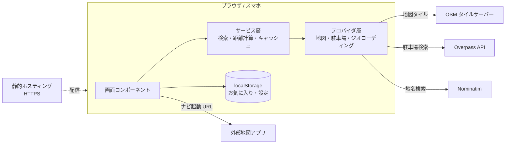
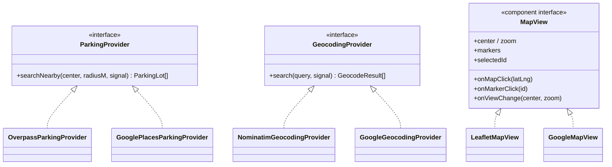
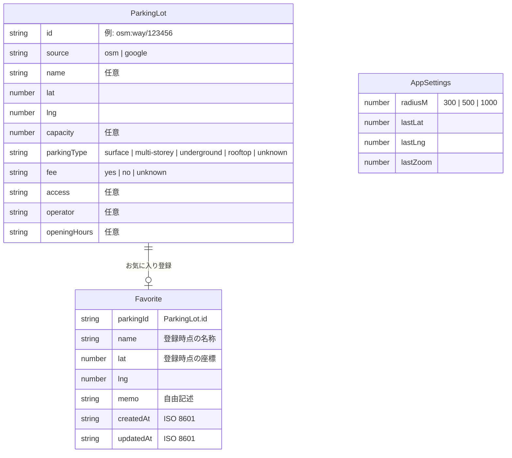
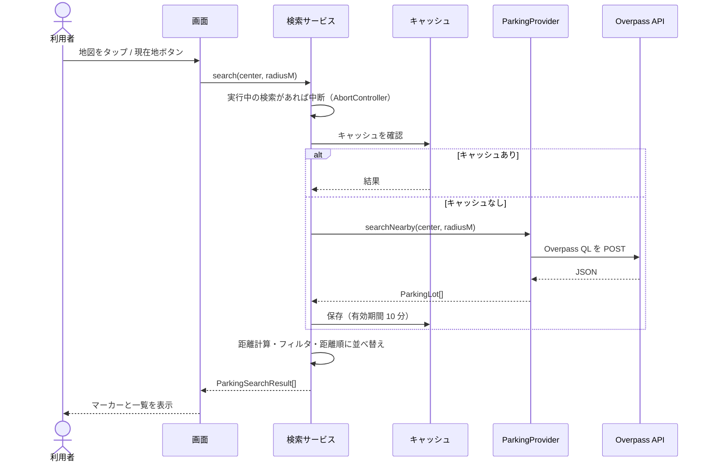
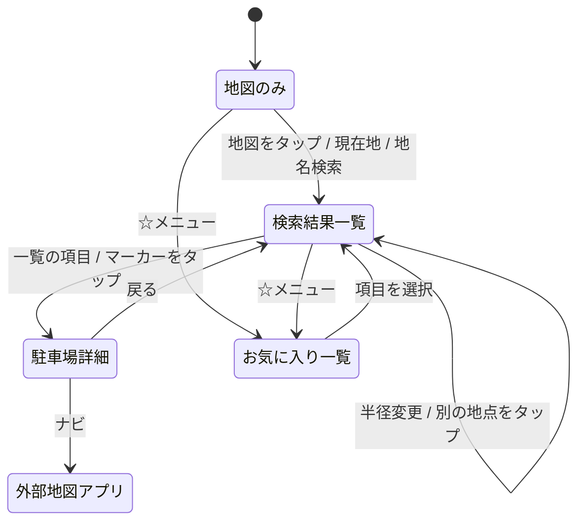
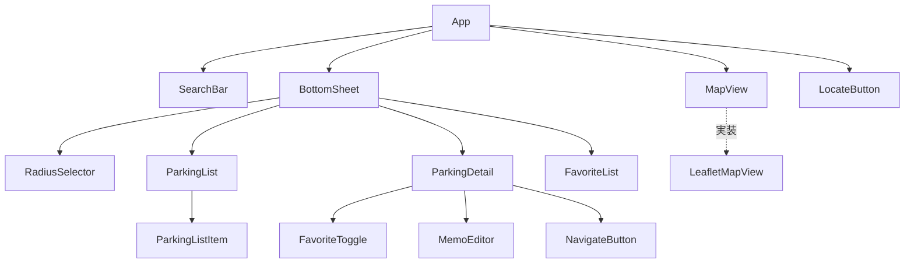

# 機能設計書

本書は `docs/product-requirements.md` で定義した機能を、どのような構成・データ・画面で実現するかを定義する。
使用する具体的な技術スタックとバージョンは `docs/architecture.md` で定義する。

## 1. システム構成

バックエンドを持たない、静的な Web アプリ（PWA）として構成する。
外部サービスへの通信はすべてブラウザから直接行う。



### 1.1 レイヤーの責務

| レイヤー | 責務 | 提供元への依存 |
|---|---|---|
| 画面コンポーネント | 表示とユーザー操作の受付 | なし（インターフェースのみ参照） |
| サービス層 | 検索の実行、距離計算・並べ替え、フィルタ、キャッシュ、連続リクエストの抑制 | なし |
| プロバイダ層 | 外部 API の呼び出しと、共通データモデルへの変換 | あり（ここだけが依存する） |
| ストレージ | localStorage の読み書きとバージョン管理 | なし |

## 2. 提供元切り替えの設計（プロバイダ抽象化）

PRD 7.2 節の要件を満たすため、提供元に依存する処理を 3 つのプロバイダに分離する。
画面とサービス層は下記のインターフェースだけを参照する。



- 初回実装では `OverpassParkingProvider`・`NominatimGeocodingProvider`・`LeafletMapView` の 3 つだけを実装する
- Google 系の実装は将来の拡張（F-12）で追加する。図では、差し込む位置を示すために記載している
- 提供元は起動時に設定値（環境変数 `VITE_PROVIDER` 等）で選択する。選択処理は 1 か所（プロバイダのファクトリ）にまとめる

### 2.1 インターフェース定義

```ts
type LatLng = { lat: number; lng: number };

interface ParkingProvider {
  /** center から radiusM メートル以内の駐車場を取得する（並べ替えはサービス層で行う） */
  searchNearby(center: LatLng, radiusM: number, signal?: AbortSignal): Promise<ParkingLot[]>;
}

interface GeocodingProvider {
  /** 地名・住所から候補地点を取得する */
  search(query: string, signal?: AbortSignal): Promise<GeocodeResult[]>;
}

/** 地図コンポーネントの props（Leaflet 版・Google 版で共通） */
type MapViewProps = {
  center: LatLng;
  zoom: number;
  searchCenter?: LatLng;          // 検索中心マーカー
  searchRadiusM?: number;         // 検索範囲の円
  markers: MapMarker[];           // 駐車場マーカー
  selectedId?: string;            // 強調表示するマーカー
  userLocation?: LatLng;          // 現在地
  onMapClick: (p: LatLng) => void;
  onMarkerClick: (id: string) => void;
  onViewChange: (center: LatLng, zoom: number) => void;
};
```

## 3. データモデル

### 3.1 エンティティ



```ts
type ParkingLot = {
  id: string;                 // 「提供元:種別/ID」で一意にする
  source: 'osm' | 'google';
  name?: string;
  location: LatLng;
  capacity?: number;
  parkingType: 'surface' | 'multi-storey' | 'underground' | 'rooftop' | 'unknown';
  fee: 'yes' | 'no' | 'unknown';
  access?: string;
  operator?: string;
  openingHours?: string;
};

/** サービス層が付与する、検索結果の表示用データ */
type ParkingSearchResult = ParkingLot & { distanceM: number };

type Favorite = {
  parkingId: string;
  name: string;
  location: LatLng;
  memo: string;
  createdAt: string;
  updatedAt: string;
};

type GeocodeResult = { label: string; location: LatLng };
```

- `Favorite` には名称と座標のスナップショットを持たせる。これにより、元データが変更・削除されても、お気に入り一覧から地図へ移動できる
- 将来、料金（F-13）を扱う場合は `ParkingLot` に任意項目として追加する。既存の項目は変更しない

### 3.2 OSM タグから ParkingLot への変換

| ParkingLot | OSM タグ | 変換ルール |
|---|---|---|
| id | 要素の type と id | `osm:{node\|way\|relation}/{id}` |
| name | `name` | 無ければ未設定（表示時に「名称不明の駐車場」とする） |
| location | node の座標 / way・relation の `center` | Overpass の `out center` を使用する |
| capacity | `capacity` | 数値に変換できない場合は未設定 |
| parkingType | `parking` | `surface` / `multi-storey` / `underground` / `rooftop` 以外は `unknown` |
| fee | `fee` | `yes` / `no` 以外（時間条件付き等）は `unknown` |
| access, operator, openingHours | `access`, `operator`, `opening_hours` | そのまま格納する |

### 3.3 localStorage のキー

| キー | 内容 |
|---|---|
| `parkfinder:v1:favorites` | `Favorite[]` |
| `parkfinder:v1:settings` | `AppSettings` |

- キーにバージョンを含め、データ形式が変わったときに移行処理を入れられるようにする
- 読み込みに失敗した場合（JSON が壊れている等）は初期値で起動し、アプリを停止させない

## 4. 機能ごとの設計

### 4.1 周辺駐車場検索（F-02〜F-06）



**Overpass クエリ**

```
[out:json][timeout:25];
(
  node["amenity"="parking"](around:{radiusM},{lat},{lng});
  way["amenity"="parking"](around:{radiusM},{lat},{lng});
  relation["amenity"="parking"](around:{radiusM},{lat},{lng});
);
out center tags;
```

**処理ルール**

| 項目 | ルール |
|---|---|
| 距離 | 中心地点からの直線距離をハーバーサイン式で計算し、メートル単位に丸める |
| フィルタ | `access=private` / `access=no` は除外する（一般利用できないため） |
| 並べ替え | 距離の昇順 |
| キャッシュキー | 中心座標を小数点以下 4 桁（約 10m）に丸めた値と半径の組み合わせ |
| キャッシュ保存先 | メモリ上（ページを再読み込みすると消える） |
| 連続タップ | 新しい検索を始めるときに、実行中の検索を中断する。加えて、直前のリクエストから 1 秒以内の外部 API 呼び出しは待ってから実行する |
| タイムアウト | 15 秒で打ち切り、エラーとして扱う |
| 現在地 | Geolocation API を使う。取得後は地図を現在地へ移動し、そこを中心に検索する |

### 4.2 地名・住所検索（F-09）

- 入力して**検索ボタンを押したとき**だけ Nominatim に問い合わせる
  - Nominatim の利用ポリシーでは入力中の自動補完が禁止されているため、入力のたびに検索する方式にはしない
- `countrycodes=jp` と `accept-language=ja` を指定し、候補は最大 5 件とする
- 候補を選ぶと地図がその地点へ移動する。周辺駐車場の検索も自動で行う

### 4.3 ナビ連携（F-07）

次の URL を新しいタブで開く。iOS・Android ともに Google マップのアプリか Web 版が起動する。

```
https://www.google.com/maps/dir/?api=1&destination={lat},{lng}&travelmode=driving
```

- 座標は数値として検証してから URL に埋め込む

### 4.4 お気に入り・メモ（F-10）

- 詳細シートの「☆」ボタンで登録・解除を切り替える
- メモは詳細シート内で編集し、入力欄からフォーカスが外れたときに保存する（最大 500 文字）
- お気に入り一覧から項目を選ぶと、地図がその駐車場へ移動し、周辺検索が実行される

### 4.5 エラー処理

| 状況 | 表示 | 利用者の操作 |
|---|---|---|
| 駐車場検索の失敗・タイムアウト | 「駐車場情報を取得できませんでした」 | 「再試行」ボタン |
| 検索結果 0 件 | 「この範囲に駐車場が見つかりませんでした」 | 「範囲を広げる」ボタン（次に大きい半径で再検索） |
| 位置情報の拒否・取得失敗 | 「現在地を取得できませんでした。端末の設定をご確認ください」 | 閉じる |
| 地名検索 0 件 | 「該当する場所が見つかりませんでした」 | 入力し直す |
| オフライン | 「オフラインです」の帯を表示 | 通信復帰後に再試行 |

## 5. 画面設計

### 5.1 画面構成

単一ページ構成とし、地図を常に表示したまま、下からせり上がるパネル（ボトムシート）で情報を切り替える。



### 5.2 ワイヤフレーム（スマホ縦向き）

**メイン画面（検索結果一覧を表示中）**

```
┌───────────────────────────┐
│ [🔍 地名・住所で検索   ][☆]│ ← 検索バー / お気に入り一覧
├───────────────────────────┤
│                           │
│        地 図              │
│      ( ○ 検索範囲 )       │
│    P    ◎中心   P         │
│         P                 │
│                      [◉] │ ← 現在地ボタン
├─────────────────────────┤
│ ───  (つまみ)             │
│ 半径 [300m][500m][1km]    │ ← 半径切替
│ 5件見つかりました          │
│ ┌───────────────────────┐ │
│ │P ○○パーキング   120m │ │
│ │  立体 / 有料 / 50台   │ │
│ ├───────────────────────┤ │
│ │P 名称不明の駐車場 210m│ │
│ │  平面 / 料金不明      │ │
│ └───────────────────────┘ │
└───────────────────────────┘
```

**駐車場詳細（ボトムシート）**

```
┌───────────────────────────┐
│ ←  ○○パーキング      [☆]│
│ 中心から 120m              │
│ 種別: 立体駐車場           │
│ 料金: 有料                 │
│ 収容台数: 50台             │
│ 営業時間: 24/7             │
│ 運営: ○○株式会社          │
│ メモ:                      │
│ ┌───────────────────────┐ │
│ │入口が狭い              │ │
│ └───────────────────────┘ │
│ [   🚗 ナビを開始   ]      │
└───────────────────────────┘
```

### 5.3 画面設計のルール

- 主要な操作（半径切替・現在地・ナビ）は画面下半分に置き、片手で届くようにする
- タップ領域は 44×44px 以上とする
- 一覧と地図のマーカーは選択状態を同期させる（片方を選ぶと、もう片方も強調表示する）
- ボトムシートは「折りたたみ / 半分 / 全画面」の 3 段階とし、地図を見たいときは折りたためるようにする
- 地図の右下に「© OpenStreetMap contributors」を常に表示する
- 外部データ（駐車場名など）はテキストとして表示し、HTML として解釈させない

## 6. コンポーネント設計



| コンポーネント | 責務 |
|---|---|
| App | 画面全体の状態（検索中心・半径・結果・選択中の駐車場・シートの表示内容）を管理する |
| SearchBar | 地名入力と候補の表示、選択 |
| MapView | 地図表示とタップ・マーカー操作の通知（実体は提供元ごとの実装） |
| LocateButton | 現在地の取得と検索開始 |
| BottomSheet | 3 段階の開閉と表示内容の切り替え |
| RadiusSelector | 検索半径の選択 |
| ParkingList / ParkingListItem | 距離順の一覧表示と選択 |
| ParkingDetail | 詳細表示、お気に入り、メモ、ナビ |
| FavoriteList | お気に入り一覧の表示と選択 |

### 6.1 状態管理

| 状態 | 保持場所 | 永続化 |
|---|---|---|
| 地図の中心・ズーム | App | する（設定として保存） |
| 検索半径 | App | する（設定として保存） |
| 検索中心・検索結果・読み込み中・エラー | 検索用カスタムフック | しない |
| 選択中の駐車場 ID | App | しない |
| お気に入り・メモ | お気に入り用カスタムフック | する |
