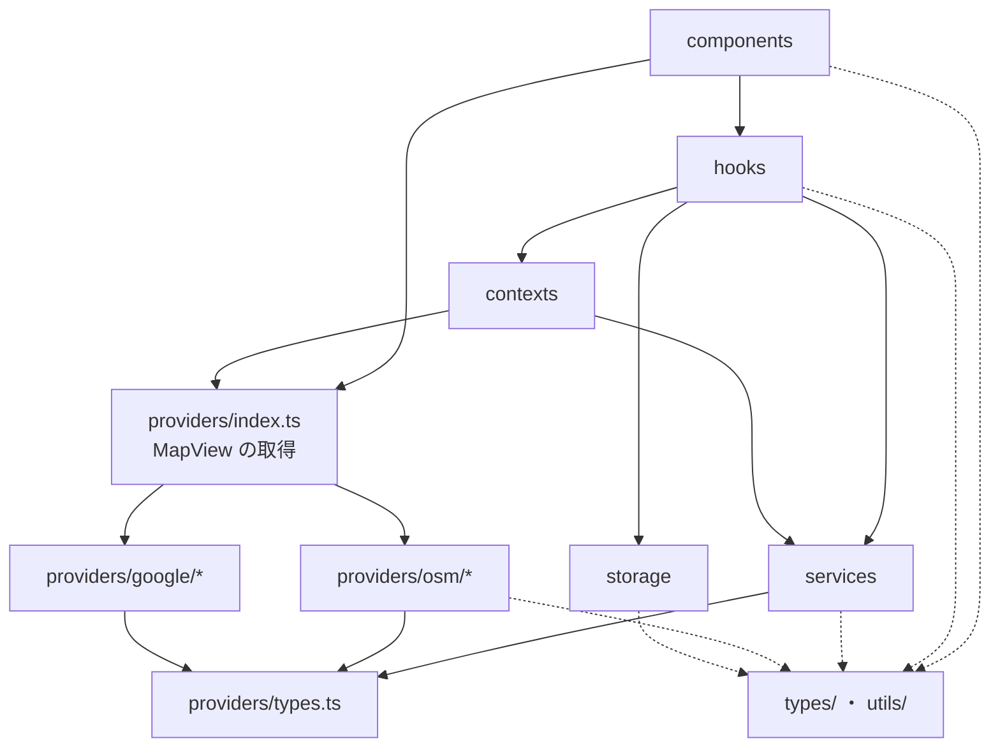

# リポジトリ構造定義書

本書はリポジトリのフォルダ・ファイル構成と、各ディレクトリの役割、ファイルの配置ルールを定義する。
レイヤー構成は `docs/functional-design.md` 1.1 節、技術スタックは `docs/architecture.md` に従う。

## 1. 全体構成

```
/
├── .devcontainer/          # 開発コンテナの設定
├── .github/
│   └── workflows/          # GitHub Actions（CI・デプロイ）
├── .steering/              # 作業単位のドキュメント
├── docs/                   # 永続的ドキュメント
├── public/                 # そのまま配信する静的ファイル（アイコン等）
├── src/                    # アプリケーションのソースコード
├── tests/                  # テスト（単体・E2E・共通設定・モック）
├── CLAUDE.md               # プロジェクトメモリ（開発ルール）
├── README.md               # 概要・起動方法
├── index.html              # エントリーの HTML（CSP の meta タグを含む）
├── package.json
├── package-lock.json
├── vite.config.ts          # Vite・PWA・CSP・Vitest の設定
├── playwright.config.ts
├── tsconfig.json           # src/ と tests/（E2E を除く）の型チェック設定
├── tsconfig.node.json      # 設定ファイルと tests/e2e/ の型チェック設定（Node.js 向け）
├── eslint.config.js
├── .prettierrc
├── .prettierignore
├── .env.example            # 環境変数の例（VITE_PROVIDER 等）
├── .gitattributes          # 改行コードを LF に統一する
└── .gitignore
```

## 2. `src/` の構成

```
src/
├── main.tsx                        # エントリーポイント
├── App.tsx                         # 画面全体の状態管理とレイアウト
├── index.css                       # Tailwind CSS の読み込みとグローバルスタイル
├── config.ts                       # 環境変数の読み込みと既定値
├── env.d.ts                        # 環境変数（import.meta.env）の型定義
│
├── components/                     # 画面コンポーネント（提供元に依存しない）
│   ├── SearchBar.tsx
│   ├── LocateButton.tsx
│   ├── BottomSheet.tsx
│   ├── RadiusSelector.tsx
│   ├── ParkingList.tsx
│   ├── ParkingListItem.tsx
│   ├── ParkingDetail.tsx
│   ├── FavoriteToggle.tsx
│   ├── MemoEditor.tsx
│   ├── NavigateButton.tsx
│   ├── FavoriteList.tsx
│   ├── ErrorMessage.tsx
│   ├── icons.tsx                   # SVG アイコン
│   └── messages.ts                 # 画面の文言と、エラーの種類から文言への変換
│
├── contexts/                       # React の Context
│   └── ServicesContext.tsx         # サービス・プロバイダの生成と、フックへの受け渡し
│
├── hooks/                          # カスタムフック（画面とサービス層をつなぐ）
│   ├── useParkingSearch.ts
│   ├── useGeocoding.ts
│   ├── useGeolocation.ts
│   ├── useFavorites.ts
│   ├── useSettings.ts
│   └── useOnlineStatus.ts
│
├── services/                       # サービス層（業務ロジック。提供元に依存しない）
│   ├── parkingSearchService.ts     # 検索の実行、距離計算、フィルタ、並べ替え
│   ├── searchCache.ts              # 検索結果のメモリキャッシュ
│   └── requestThrottle.ts          # 外部 API 呼び出し間隔の制御
│
├── providers/                      # プロバイダ層（提供元への依存はここだけ）
│   ├── types.ts                    # ParkingProvider・GeocodingProvider・MapViewProps の定義
│   ├── index.ts                    # 設定値に応じて提供元を選ぶファクトリ
│   ├── fetchJson.ts                # 提供元に共通の通信処理（タイムアウト、エラー変換）
│   ├── osm/
│   │   ├── overpassParkingProvider.ts
│   │   ├── overpassMapper.ts       # OSM タグ → ParkingLot の変換
│   │   ├── nominatimGeocodingProvider.ts
│   │   └── LeafletMapView.tsx
│   └── google/                     # 将来の拡張（F-12）で追加する
│
├── storage/                        # localStorage の読み書き
│   ├── storage.ts                  # 共通処理（JSON 変換、失敗時の既定値）
│   ├── favoritesStorage.ts
│   └── settingsStorage.ts
│
├── types/
│   └── domain.ts                   # LatLng・ParkingLot・Favorite 等の共通型
│
├── utils/                          # 副作用のない汎用関数
│   ├── distance.ts                 # ハーバーサイン式による距離計算
│   ├── navigation.ts               # ナビ起動 URL の生成
│   ├── parkingDisplay.ts           # 駐車場の表示名・種別・料金区分の表記
│   └── validation.ts               # 入力値・座標の検証
```

## 3. `tests/` の構成

テストコードはすべて `tests/` にまとめ、`src/` には本番コードだけを置く。
単体テストは `src/` と同じディレクトリ構成で配置し、テスト対象のファイルをすぐに見つけられるようにする。

```
tests/
├── unit/                           # 単体テスト（Vitest）。src/ と同じ構成にする
│   ├── components/
│   │   └── ParkingList.test.tsx
│   ├── hooks/
│   │   └── useParkingSearch.test.ts
│   ├── services/
│   │   └── parkingSearchService.test.ts
│   ├── providers/
│   │   └── osm/
│   │       └── overpassMapper.test.ts
│   ├── storage/
│   │   └── favoritesStorage.test.ts
│   └── utils/
│       └── distance.test.ts
│
├── e2e/                            # E2E テスト（Playwright）
│   ├── search.spec.ts
│   ├── favorites.spec.ts
│   └── support/                    # 外部 API の差し替えなど、E2E テスト共通の処理
│
├── helpers/                        # 単体テスト共通の処理（モックのサービスで描画する等）
│   └── renderWithServices.tsx
├── mocks/                          # MSW のリクエストハンドラ
│   ├── handlers.ts
│   └── server.ts
├── fixtures/                       # Overpass・Nominatim の応答サンプル
│   ├── overpass-parking.json
│   ├── overpass-empty.json
│   ├── overpass-malformed.json
│   └── nominatim-search.json
└── setup.ts                        # Vitest の初期設定
```

- `tests/mocks/` と `tests/fixtures/` は単体テストと E2E テストの両方から使ってよい
- Vitest は `tests/unit/`、Playwright は `tests/e2e/` だけを対象にするよう設定する
- Vitest は、DOM が不要なテストを node 環境、コンポーネント（`.tsx`）・`hooks/`・`storage/` のテストを jsdom 環境で実行する（jsdom の起動が遅いため）
- テストから `src/` のファイルを import するときは、パスエイリアス `@/`（`src/` を指す）を使う（例：`import { calcDistance } from '@/utils/distance'`）

## 4. ディレクトリの役割

| ディレクトリ | 役割 | 置いてよいもの | 置いてはいけないもの |
|---|---|---|---|
| `components/` | 表示とユーザー操作の受付 | React コンポーネント | 外部 API の呼び出し、localStorage への直接アクセス |
| `contexts/` | サービス・プロバイダをフックに渡す | Context と Provider、それを使うフック | 業務ロジック |
| `hooks/` | 状態の管理と、サービス層・ストレージの呼び出し | カスタムフック | JSX による描画、画面の文言 |
| `services/` | 検索の業務ロジック | React に依存しない関数・クラス | React、提供元のライブラリ（Leaflet 等）の import |
| `providers/` | 外部サービスの呼び出しと、共通データモデルへの変換 | インターフェース定義、提供元ごとの実装 | 業務ロジック（距離順の並べ替え等） |
| `storage/` | ブラウザへの保存と読み込み | localStorage を扱う関数 | 業務ロジック |
| `types/` | 複数のレイヤーで使う共通の型 | 型定義のみ | 実装コード |
| `utils/` | 汎用的な計算・変換 | 副作用のない関数 | 外部通信、状態を持つ処理 |
| `public/` | ビルドで加工せずに配信するファイル | PWA アイコン、favicon | ソースコード |
| `tests/unit/` | 単体テスト | Vitest のテスト | E2E テスト |
| `tests/e2e/` | ブラウザを使った画面操作のテスト | Playwright のテスト | 単体テスト |
| `tests/mocks/`・`tests/fixtures/` | テスト用のモックと固定データ | MSW のハンドラ、API の応答サンプル | 本番コードから参照されるもの |
| `tests/helpers/` | 単体テスト共通の処理 | 描画・モック生成の補助関数 | テストケース |

- `src/` の中にはテストコード・モック・テスト用データを置かない

## 5. 依存関係のルール

各レイヤーは、下の図の矢印の方向にだけ依存してよい。



- `providers/osm/` と `providers/google/` の中身を直接 import してよいのは、`providers/index.ts` だけとする
- Leaflet・react-leaflet を import してよいのは `providers/osm/` だけとする（Google 用ライブラリも同様に `providers/google/` だけ）
- `types/` と `utils/` はどのレイヤーからも参照してよい。逆に、`types/` と `utils/` から他のレイヤーを参照してはいけない
- `src/` から `tests/` を参照してはいけない
- これらのルールは ESLint の `no-restricted-imports` で機械的に検査する（`tests/` のファイルには適用しない）

## 6. ファイル配置ルール

### 6.1 ファイル名

| 種類 | 形式 | 例 |
|---|---|---|
| React コンポーネント | パスカルケース `.tsx` | `ParkingList.tsx`、`LeafletMapView.tsx` |
| カスタムフック | `use` から始まるキャメルケース `.ts` | `useParkingSearch.ts` |
| その他の TypeScript | キャメルケース `.ts` | `parkingSearchService.ts` |
| 単体テスト | 対象ファイル名 ＋ `.test.ts(x)` | `tests/unit/utils/distance.test.ts` |
| E2E テスト | 機能名 ＋ `.spec.ts` | `tests/e2e/search.spec.ts` |

### 6.2 配置の原則

- **1 ファイルにつき 1 コンポーネント**とする。そのコンポーネント専用の小さな部品は、同じファイル内に置いてよい
- **単体テストは `tests/unit/` 配下の、`src/` と同じ相対パスに置く**（例：`src/utils/distance.ts` のテストは `tests/unit/utils/distance.test.ts`）
- **提供元を追加するときは `providers/{提供元名}/` を作り**、`providers/types.ts` のインターフェースを実装する。変更が必要なのは `providers/index.ts` の選択処理だけにする
- **フォルダの中を再エクスポートするだけの `index.ts` は作らない**。例外は `providers/index.ts`（提供元を選ぶ役割を持つため）とする
- 迷った場合は「React に依存するか」「提供元に依存するか」「副作用があるか」で配置先を判断する

### 6.3 管理しないファイル（`.gitignore`）

- `node_modules/`、`dist/`、`coverage/`
- Playwright の出力（`test-results/`、`playwright-report/`）
- `.env`、`.env.local`（`.env.example` はコミットする）
